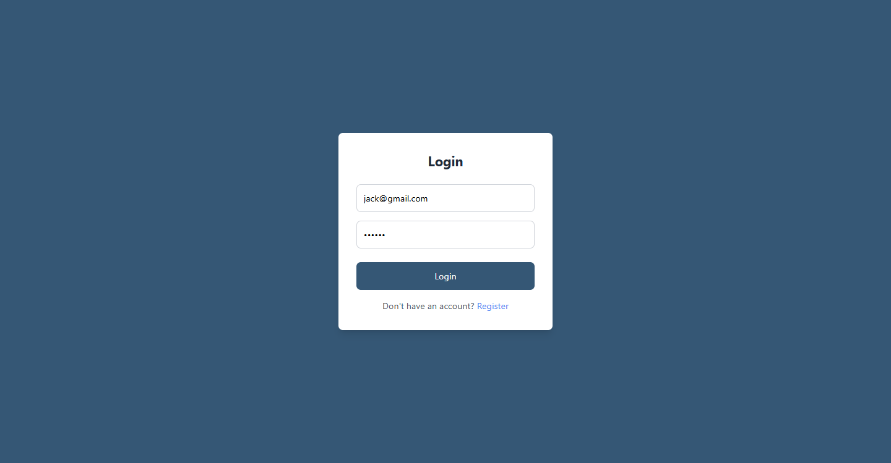
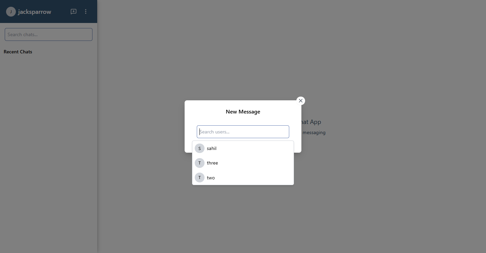
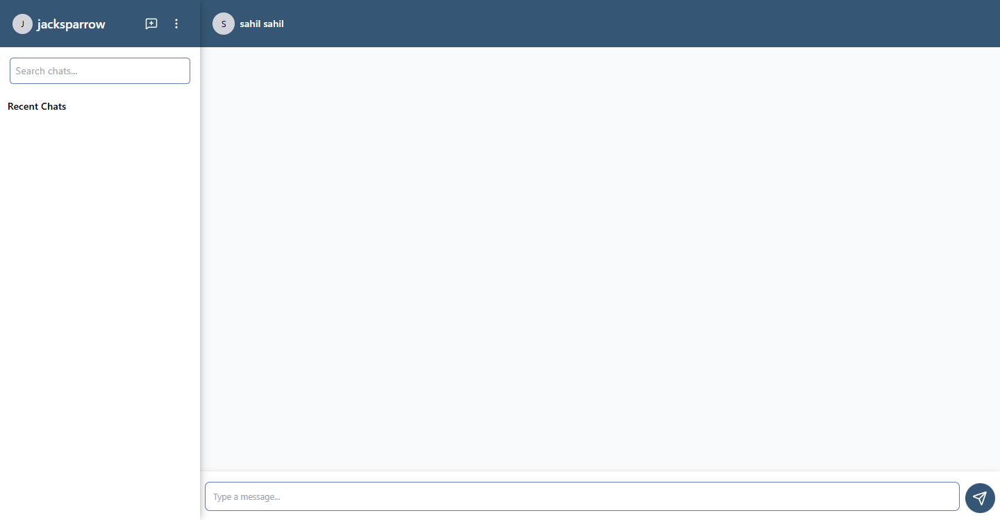
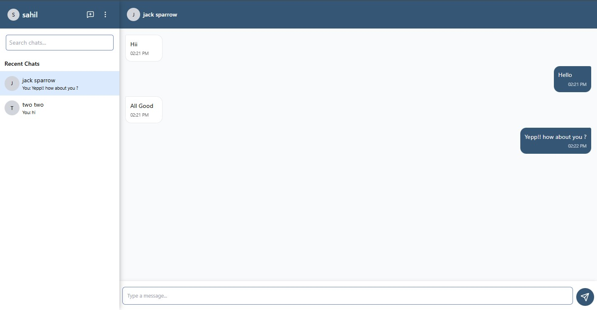
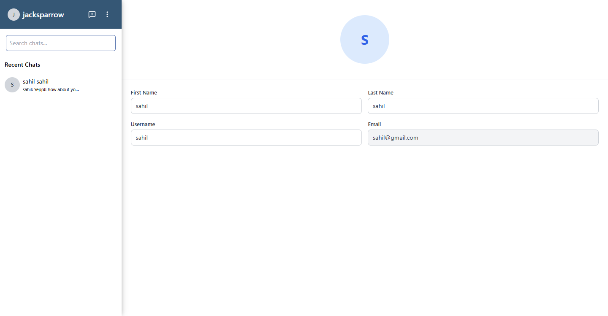
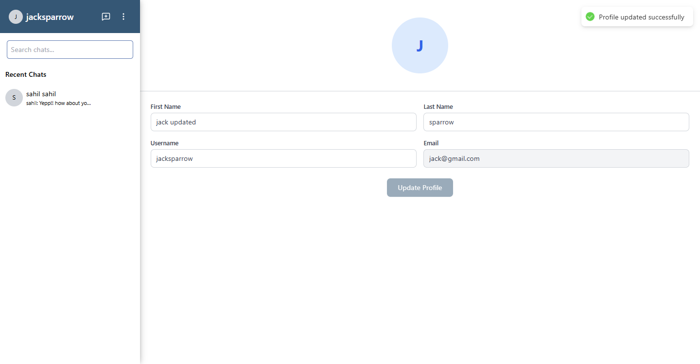
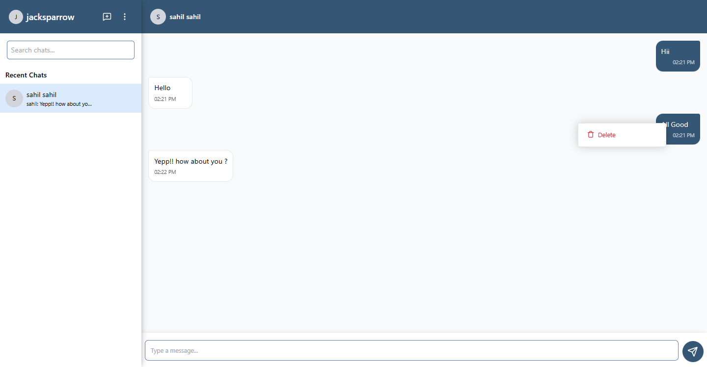
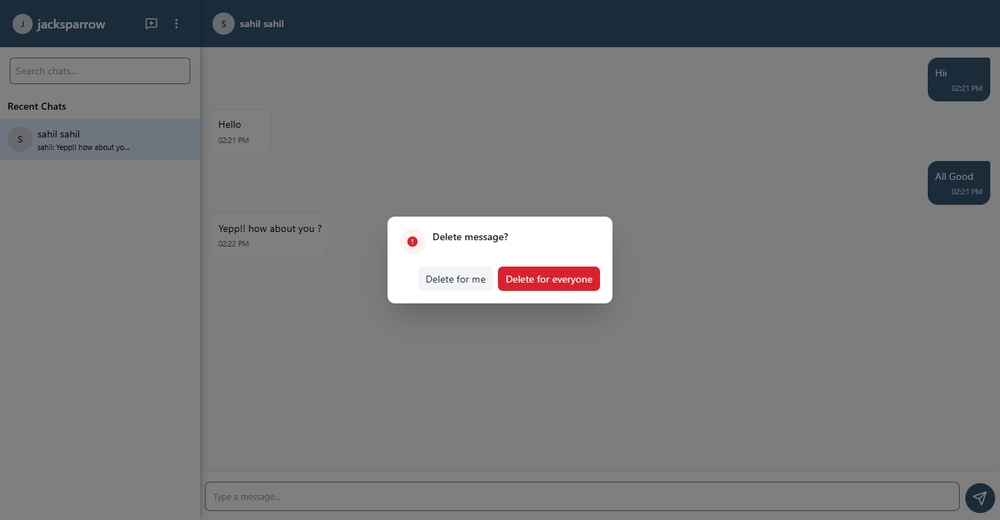
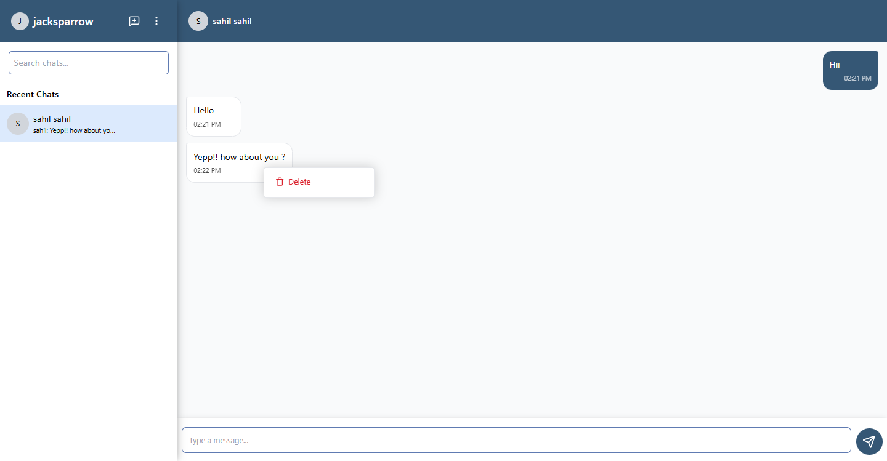
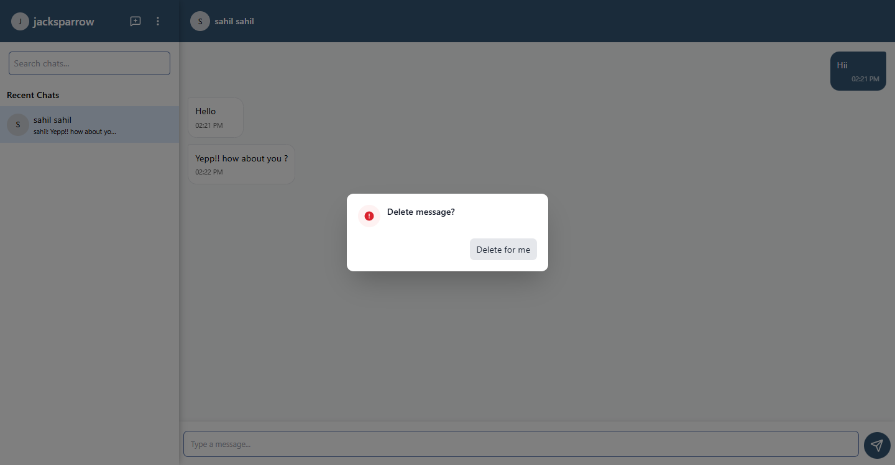

# Chat App Mini

Chat app mini is a trimmed down fork of original chat application built using React, Node.js and MongoDB

## 🌟 Features

- Login/Register
- Basic Realtime Text chat
- Multiple users
- Responsive design
- User Profile
- Delete Messages (For me/ For Everyone)

## 🚀 Prerequisites

### For Development

- Node.js (v16 or higher recommended)
- npm or yarn package manager
- MongoDB (local or MongoDB Atlas)

## �️ MongoDB Setup

### Option 1: Local MongoDB Installation

1. Download and install MongoDB Community Server from [MongoDB's official website](https://www.mongodb.com/try/download/community)
2. Follow the installation instructions for your operating system
3. Start the MongoDB service:
   - **Windows**: Run `net start MongoDB` (if installed as a service) or use MongoDB Compass GUI
   - **macOS/Linux**: Run `sudo systemctl start mongod` or `brew services start mongodb-community`
4. Verify installation by running `mongod --version`

### Option 2: MongoDB Atlas (Cloud)

1. Go to [MongoDB Atlas](https://www.mongodb.com/cloud/atlas/register)
2. Create a free account or sign in
3. Create a new cluster (choose the free tier)
4. Create a database user with read/write access
5. Add your current IP address to the IP whitelist
6. Get your connection string from the "Connect" button

### MongoDB Compass (Optional but Recommended)

- Download and install [MongoDB Compass](https://www.mongodb.com/try/download/compass) for a GUI to manage your databases

## ️ Installation

### 1. Clone the repository

```bash
git clone <repository-url>
cd todoPlanner
```

### 2. Install Dependencies

#### Option 1: Install all dependencies at once (Recommended)

````bash
# This will install root, backend, and frontend dependencies
npm run install:all


#### Option 2: Install dependencies separately
```bash
# Install root dependencies (including concurrently)
npm install

# Install backend dependencies and copy environment file
npm run install:backend
cp backend/.env.example backend/.env

# Install frontend dependencies and copy environment file
npm run install:frontend
cp frontend/.env.example frontend/.env
````

### 3. Configure Environment Variables

#### Backend (backend/.env)

```env
PORT=3001
NODE_ENV=development
MONGODB_URI=mongodb://127.0.0.1:27017/chat-app-mini
JWT_SECRET=your_jwt_secret_key
JWT_ACCESS_EXPIRATION=15m
JWT_REFRESH_SECRET=your_refresh_token_secret
JWT_REFRESH_EXPIRATION=7d
CLIENT_URL=*
RATE_LIMIT_WINDOW_MS=900000  # 15 minutes
RATE_LIMIT_MAX=200           # Max requests per window
AUTH_RATE_LIMIT_MAX=20       # Max auth requests per window
CORS_ORIGIN=*
CORS_METHODS=GET,POST,PUT,DELETE,OPTIONS
CORS_ALLOWED_HEADERS=Content-Type,Authorization
COOKIE_SECRET=your_cookie_secret
HELMET_ENABLED=true
RATE_LIMIT_ENABLED=true
```

#### Frontend (frontend/.env)

```env
VITE_API_URL=http://localhost:3001
```

## 🏃‍♂️ Running the Application

### Option 1: Using Concurrently (Recommended)

From the root directory, run:

```bash
npm run dev
```

This will start both the backend and frontend servers simultaneously.

### Option 2: Run Servers Separately

If you prefer to run them separately:

1. Start the backend server:

   ```bash
   cd backend
   npm run dev
   ```

2. In a new terminal, start the frontend development server:
   ```bash
   cd frontend
   npm run dev
   ```

### Access the Application

- Frontend: `http://localhost:5173`
- Backend API: `http://localhost:3001`

## 📦 Screenshots

### 1. Login



### 2. Register


### 3. Dashboard


### 4. NewChat


### 5. UserSearch



### 6. NewChatWindow



### 7. Chats



### 8. OtherUserProfile



### 9. CurrentUserProfile


### 10. UpdateProfile



### 11. SameUserRightClickOnMessage



### 12. SameUserDeleteModal



### 13. OtherUserRightClickMessage



### 14. OtherUserDeleteMessageModal


